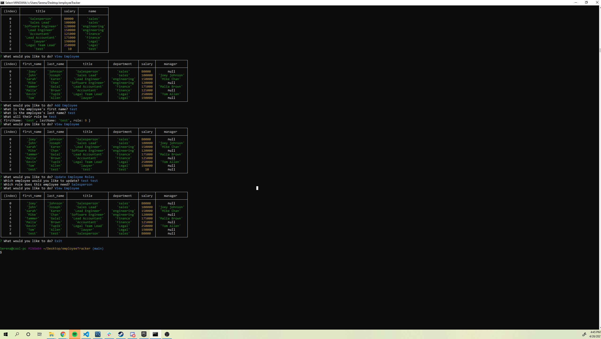

# employeeTracker

## Summary of program
-This program will allow the user to create and edit a database of employees. The user can view and create departments, roles, and employees. 


## Built With 
-Javascript 
-MySql

## Program Preview



## Code Snippets

The function used to view employees, required me to join multiple tables together.
```
function viewEmployee() {
  connection.query(
    `SELECT e.first_name, e.last_name, title, name AS department, salary, concat(m.first_name, " ",  m.last_name ) AS manager 
    FROM department
    LEFT JOIN role ON department.id = role.department_id
    RIGHT JOIN employee e ON role.id = e.role_id
    LEFT JOIN employee m ON e.id = m.manager_id;
    `,
    (err, res) => {
      if (err) throw err;
      console.table(res);
      start();
    }
  );
}
```

The function used to update pre-existing employees. Used the UPDATE method built into Sql to locate and edit employee's role ids
```

function UpdateEmployeeRoles() {
  connection.query(`SELECT title, id FROM role`, (err, res) => {
    if (err) throw err;
    const roles = res.map((row) => {
      return { name: row.title, value: row.id };
    });

    connection.query(
      `SELECT first_name, last_name, role_id FROM employee`,
      (err, res) => {
        if (err) throw err;
        const names = res.map((row) => {
          return {
            name: row.first_name + " " + row.last_name,
            value: row.role_id,
          };
        });

     

        inquirer
          .prompt([
            {
              type: "list",
              message: "Which employee would you like to update?",
              name: "employee",
              choices: names,
            },
            {
              type: "list",
              message: "Which role does this employee need?",
              name: "role",
              choices: roles,
            },
          ])
          .then((answer) => {
            
            connection.query(`UPDATE employee SET role_id = ? WHERE role_id = ?`, [
              answer.role,
              answer.employee,
            ]);
            start();
          });
      }
    );
  });
}
```
## My Links

[GitHub](https://github.com/SerenaChandler)

[repo](https://github.com/SerenaChandler/employeeTracker)

[Demo](https://www.youtube.com/watch?v=VHRX4WJnNXE)